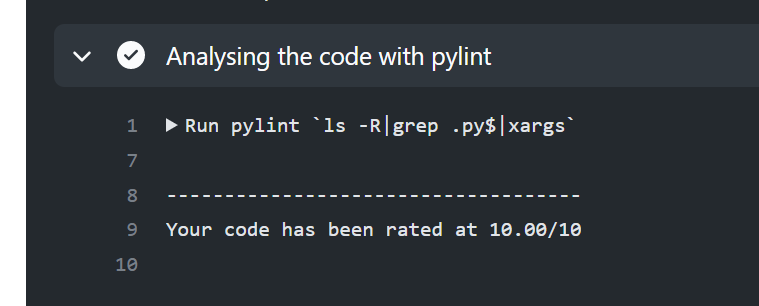

# Connect4 AI

Python bot to play connect4, uses Q-Learning based on the Greedy Epsilon Bellman Equation 
## Installation

1. Unzip the latest version of `q_table_shelf.db (version)` and place in root
2. Install numpy
```bash
pip install numpy
```

## Usage
	
+ To play a best of 3 against the AI:

```bash
python gameAIButBetter.py
```
	The gameboard is  2D list and is represented in this form, positions to drop a `COIN` are from 1 to 7

* To train the model:
```bash
python train.py
```
&nbsp&nbsp&nbsp&nbspBy default this will train the model for 60000 episodes, the model in `q_table_shelf.db` has been trained for 200,000 episodes over 10 hours



