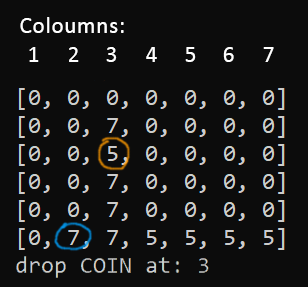

# Connect4 AI
[](https://github.com/technocrat13/Connect4Bot/actions/workflows/build.yml)
[](https://github.com/technocrat13/Connect4Bot/actions/workflows/pytest.yml)
[](https://github.com/technocrat13/Connect4Bot/actions/workflows/pylint.yml)


Python bot to play connect4, uses Q-Learning based on the Greedy Epsilon Bellman Equation.

https://youtube.com/shorts/njdJeu95p6s?si=jI39STsb80ijHa8h

## Installation

1. Unzip `q_table_shelf.db.zip` and place the three files in root.
2. Install `numpy`
```bash
pip install numpy
```

## Usage
	
* To play a best of 3 against the AI:

	```bash
	python connect4.py
	```


* To train the model:
	```bash
	python train.py
	```
	By default this will train the model for 60,000 episodes, the model in `q_table_shelf.db` has been trained for 200,000 episodes/10 hours.
	


## Information

The gameboard is a 2D list and is represented in the following image, positions to drop a `COIN` are from 1 to 7, player one is `7`, the AI is player two or `5`. `0` represents an empty space.




## References
+ Trust me bro
+ [An AI agent learns to play tic-tac-toe (part 3): training a Q-learning RL agent](https://towardsdatascience.com/an-ai-agent-learns-to-play-tic-tac-toe-part-3-training-a-q-learning-rl-agent-2871cef2faf0)
+ [Notebook for Topic 08 Video - Q-Learning - A Complete Example in Python.ipynb](https://colab.research.google.com/drive/1E2RViy7xmor0mhqskZV14_NUj2jMpJz3#scrollTo=Kq-QPfDnx4Fo)
